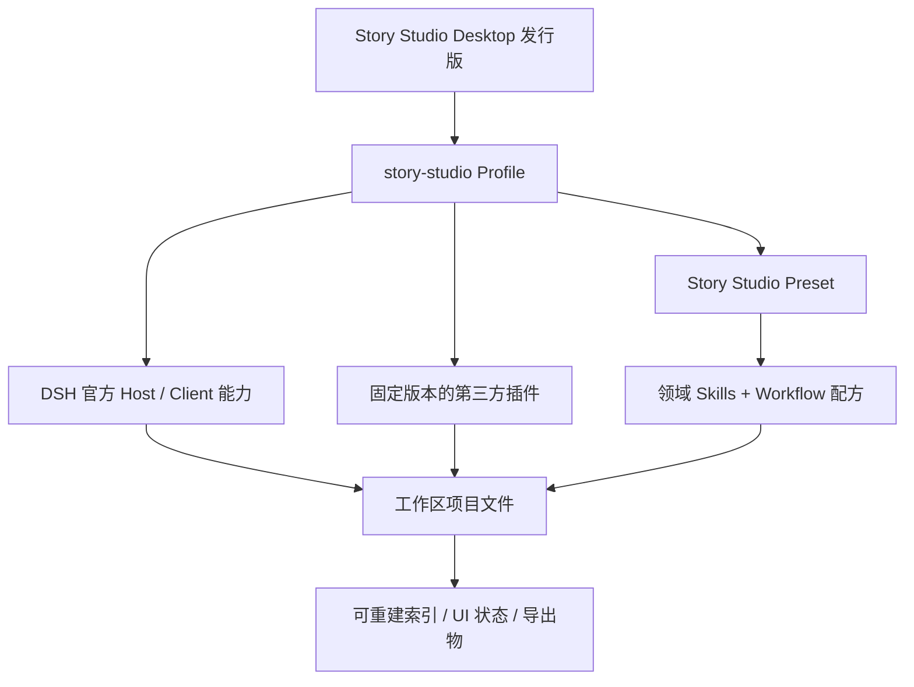

# Story Studio 总体实施方案

## 1. 问题与目标

内部编剧可能只提供一句故事想法，也可能提供完整的专业需求、原剧本、人物资料、平台要求和集数约束。产品需要在两种输入下都有效工作：

- 输入模糊时，只追问会改变整体结构的高影响问题，其余内容以可审阅草案推进；
- 输入充分时，不重复做问卷，直接整理需求、规划任务并生成可交付文件；
- 长篇和系列创作中，人物、时间线、世界规则、伏笔和已有正文必须持续可检索、可审校；
- Agent 的创作结果必须落到项目工作区，能够查看、修改、比较和撤销；
- DSH 和 Desktop 上游升级后，产品能力能够通过 Profile 和插件版本边界重新验证，而不是维护一份大规模 fork。

首个版本面向内部编导，不包含商业化基础设施。成功标准是让编剧稳定完成“创建作品 -> 需求整理 -> 设定与人物 -> 大纲 -> 分集/分章 -> 正文 -> 审校”的真实工作，而不是先做完整 SaaS 管理后台或专业排版导出。

## 2. 架构结论

Story Studio 采用六层组合：

### 2.1 产品发行层

发行层负责应用品牌、默认 Profile、固定插件清单、系统 Preset 根、升级和打包。它不接管第三方插件的业务实现，也不向 Web renderer 暴露 Electron API。

通用 DSH Desktop 能力应继续保持独立。Story Studio 的默认 Profile、Preset 和领域资源由产品层追加，避免把短剧/小说逻辑写进通用桌面壳。

### 2.2 Profile 组合层

专用 `story-studio` Profile 直接组合官方 `dsh-base`、`dsh-web-app`、产品资源和通过审核的第三方 bundle。Desktop launcher 仍只临时叠加 Desktop layer，并保持普通 DSH Client 插件图。

Profile 必须固定插件版本或 commit，不允许运行时自动跟随 GitHub `main` 或 npm `latest`。用户可在独立 Profile 中试用其他插件，但生产 Profile 的清单由产品维护。

### 2.3 官方能力层

以下能力直接使用 DSH 官方 seam，不建立平行实现：

- `ctx.sessions`、session persistence 和 session query；
- `ctx.workspaceRegistry` 和目录选择；
- `ctx.fs`、文件工具、搜索工具和观察策略；
- `ctx.attachments`、`ctx.storage`、`ctx.storageDomain`；
- `ctx.agentPresets`、`ctx.skills`、`ctx.agents`；
- `ctx.subagents`、`ctx.workflowEngine`、`ctx.jobs`、`ctx.goals`；
- `ctx.userQuestions`、approval、permissions；
- `ctx.web`、commands、settings；
- Client Slots、conversation views、官方 deliverables 和工具展示。

### 2.4 第三方插件层

第三方插件解决通用而非 Story Studio 独有的问题，例如文件编辑、Git、Office 解析、回退和本地知识库。详细选择见[插件选型与复用矩阵](plugin-selection.md)。

第三方插件不可以决定产品的项目目录合同、创作阶段、核心 Agent 行为或内容事实源。这样即使替换某个插件，已有作品也不会被锁死。

### 2.5 Preset、Skill 与 Workflow 层

首个 MVP 只维护一个 `Story Studio` Preset。Preset 负责 Agent persona、官方工具组合、Skill 根和子智能体/Workflow 能力；具体专业方法放在 Skills 中。

Workflow 使用 DSH 动态 Workflow 引擎执行，不建立另一套任务编排器。可复用编排模式以 Skill 中的“配方”表达，由 Agent 按任务规模决定串行、并行或直接执行。

### 2.6 薄领域层

只有以下需求在 Skills 和文件合同无法稳定解决后，才建立产品自有 Cordis 包：

- 对 `story.yml` 和项目结构做确定性解析、迁移和验证；
- 提供作品状态、创作风险和下一步的结构化 Host API；
- 在官方 Slots 或可选侧边栏 service 中提供项目首页；
- 提供插件无法可靠实现的跨文件一致性索引。

这个包必须保持“深模块”边界：少量稳定接口封装项目解析、状态推导和校验，UI 只消费其结果，不在组件中重复读取和解释目录。

## 3. 拟建模块

### 3.1 Story Studio 发行组合

职责：创建/修复产品 Profile、固定 bundle 顺序、注入产品系统 Preset 根、声明默认 Preset、携带第三方许可和版本锁。

它只拥有产品 Profile，不改写用户建立的其他 Profile。Profile 启动失败时继续遵循 Desktop 的 pending generation 和 last-known-good 回滚规则。

### 3.2 Story Studio Preset

职责：提供创作主理人 persona、官方文件/搜索/Web/子智能体/Workflow 工具和产品 Skill 目录。它不硬编码“必须按九阶段执行”，也不在每次会话启动时自动创建项目。

### 3.3 领域 Skills

首批 Skills：

1. `story-intake`：需求完整度、冲突检测、假设和高影响问题；
2. `story-project`：项目初始化、文件合同、状态和交付位置；
3. `short-drama-writing`：短剧季纲、分集、钩子、反转、卡点和分场正文；
4. `novel-writing`：卷章、大纲、长程人物演化、伏笔和章节正文；
5. `reference-analysis`：参考材料拆解、事实引用、风格抽象和表达隔离；
6. `story-review`：一致性、节奏、人物、时代事实、格式和修订建议。

`story-project` 可以携带纯 Node 脚本和 schema，提供确定性的初始化、检查和状态聚合。脚本通过官方 shell/fs 工具运行，不需要为了三个确定性操作先创建 Host 插件。

### 3.4 项目工作台

产品 Client Slot 覆盖空白会话的 Workspace 选择器并增加“新建作品”入口。创建弹窗只接收作品名称，Host 在统一全局根目录中建立项目合同，再通过官方 Workspace API 注册、重命名并切换作品。

中间继续使用官方 conversation；右侧直接使用内置 `dsh-workbench` 的 Explorer、Monaco 多标签编辑器和 Markdown 预览。产品层不重新实现通用文件树、编辑器或聊天界面。

## 4. 关键用户流程

### 4.1 新项目

1. 编剧点击“新建作品”并输入作品名称，系统在统一根目录创建并切换工作区；
2. 输入故事想法、专业需求或导入参考材料；
3. Agent 识别本轮交付物和结构性冲突；
4. 必要时一次询问不超过三个高影响问题；
5. 生成 `brief.md` 和 `story.yml`，记录事实、假设和待决项；
6. 根据任务规模直接创作或调度子智能体；
7. 终审后落盘，官方 deliverables 和文件工作台展示产物；
8. 修改前建立 checkpoint，用户可查看 diff、继续修改或回退。

### 4.2 已有作品续写

1. Agent 先读取 `story.yml`、brief、相关设定、最近大纲和正文；
2. 只加载本轮必要上下文，不把全部世界书和所有章节塞入请求；
3. 必要时搜索项目文件或知识索引；
4. 生成草稿、审校前文冲突并更新人物/时间线/伏笔记录；
5. 任何对既有正文的覆盖都通过 checkpoint 和可查看 diff 保护。

### 4.3 对标与参考材料

1. 原文件保存在 `references/source/` 或记录其外部路径；
2. Rich File Reader/Office 工具提取可读内容；
3. 分析产物记录来源文件、页码/章节/片段位置；
4. Skill 只抽象结构、节奏、人物功能和风格特征，不复制受保护表达；
5. 最终创作使用项目自己的设定与表达，参考分析和正文分目录保存。

## 5. 分阶段交付

### 阶段 0：组合验证

在隔离 DSH home 和一次性 Profile 中验证候选插件，不改变产品默认 Profile。交付物是兼容性报告、固定版本候选和明确淘汰项。

### 阶段 1：创作能力 MVP（已完成）

交付产品 Profile、一个 Preset、六个 Skills、项目模板、插件锁和自动化场景测试。用户通过官方聊天、工作区、deliverables 和选定文件插件完成创作流程。

### 阶段 2：名称创建与工作台（已完成）

实现确定性项目创建模块和产品 Client Slot：只输入作品名称，在统一根目录初始化项目并注册 Workspace；中间保留官方对话，右侧复用 Better Sidebar 文件树与预览。专业排版导出不在当前阶段。

### 阶段 3：长篇知识能力

以真实中文剧本和小说建立检索基准。只有当普通文件搜索和摘要不能满足长篇召回时，才选择一个 RAG 插件进入产品 Profile。

### 阶段 4：内部发行（本轮不执行）

完成 macOS/Windows 打包、第三方许可、离线/弱网边界、升级回滚和内部安装说明。继续不包含账号、计费和公共云协同。

## 6. 明确不做

- 不修改 `deepseek-harness/` 子模块；
- 不重做 DSH 会话、工作区、文件、附件、模型、任务和 Agent Runtime；
- 不把现有 `script-studio` 样例直接发布为产品；
- 不把第三方小说插件的数据模型直接设为 Story Studio 标准；
- 不让社区市场结果自动安装进生产 Profile；
- 不在 MVP 中开发会员、支付、云存储、组织权限或外部协作；
- 不在没有真实召回基准前引入向量数据库和本地 embedding 运行时。

## 7. 分支与上游同步

- `master` 继续作为 Anywhere Labs 上游的干净镜像；
- `product/story-studio` 与旧 `feat/story-studio-*` 分支只保留历史实现，不再并行开发或继续堆叠；
- Story Studio V2 统一在 `codex/story-studio-workbench-v2` 开发，完成前不再为普通交付切片创建新的叠加分支；
- 每个可验证的逻辑提交完成后立即推送到同名远程分支，交付状态必须同时核对本地与远程提交；
- 上游 submodule pin 和运行时版本升级使用独立提交；
- 第三方插件锁更新和 Story Studio 行为变化分开提交；
- 每次上游同步后重新执行 Profile Loader、插件组合和打包门禁。
